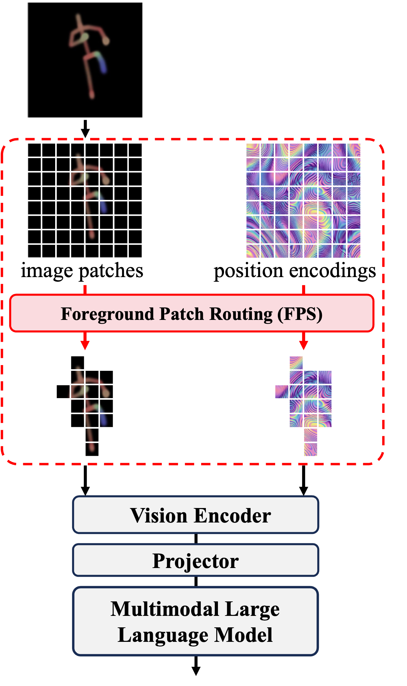

## Contents

**Reviewer 92aF**

- [Table 1 – Renderer vs. Training Pipeline Ablation (W1/Q1)](#table-1)
- [Table 2 – Single-Person vs. Two-Person Actions (W2/Q2)](#table-2)
- [Table 3 – Joint Dropout Robustness (W3/Q3)](#table-3)
- [Table 4 – Gaussian Noise Robustness (W3/Q3)](#table-4)
- [Table 5 – Modality Bridge FLOPs Comparison (W4/Q4)](#table-5)
- [Table 6 – Capability Comparison with SUGAR (W4/Q4)](#table-6)
- [Table 7 – Foreground Patch Sparsification (W4/Q4)](#table-7)
- [Figure 1 – FPS Concept Illustration (W4/Q4)](#figure-1)

**Reviewer y5PT**

- [Table 8 – Sec. 3 Revision Summary (W1)](#table-8)
- [Table 9 – Sec. 2.3 Citation Additions (W2)](#table-9)
- [Table 10 – Single-Model Multi-Task Evaluation (W3/Q3)](#table-10)
- [Table 11 – DrAction + External MLLMs (W4/Q2)](#table-11)
- [Table 12 – Cross-Dataset Joint Training (Q4)](#table-12)

---

## Reviewer 92aF

### Table 1: Renderer vs. Training Pipeline Ablation, NTU-60 48/12 Xsub, identical pipeline (W1/Q1)

| Renderer | Stage 1&4 Only | Full Four-Stage | Δ (Pipeline) |
| :--- | :---: | :---: | :---: |
| 3D+Velocity | 56.18 | 58.77 | +2.59 |
| DrAction (Ours) | 62.09 | 64.72 | +2.63 |
| **Δ (Renderer)** | **+5.91** | **+5.95** | — |

---

### Table 2: Single-Person vs. Two-Person Actions, NTU-60 48/12 (W2/Q2)

| Action Type | SkeletonLLM | TDSM | PURLS |
| :--- | :---: | :---: | :---: |
| Single-person | 60.27 | 58.42 | 44.10 |
| Two-person | 75.37 (+15.10) | 50.85 (−7.57) | 34.23 (−9.87) |

---

### Table 3: Joint Dropout Robustness, NTU-60 48/12 Xsub, 3-run avg (W3/Q3)

| Dropout | SkeletonLLM | InternVL3-8B† (Fixed) | TDSM |
| :---: | :---: | :---: | :---: |
| 0% | 64.72 | 56.28 | 56.03 |
| 10% | 63.44 (−1.28) | 53.58 (−2.70) | 52.76 (−3.27) |
| 20% | 61.49 (−3.23) | 49.89 (−6.39) | 47.58 (−8.45) |
| 30% | 58.88 (−5.84) | 45.02 (−11.26) | 41.83 (−14.20) |
| 50% | 52.37 (−12.35) | 37.34 (−18.94) | 31.07 (−24.96) |

---

### Table 4: Gaussian Noise Robustness, NTU-60 48/12 Xsub, σ in cm, 3-run avg (W3/Q3)

| σ (cm) | SkeletonLLM | InternVL3-8B† (Fixed) | TDSM |
| :---: | :---: | :---: | :---: |
| 0 | 64.72 | 56.28 | 56.03 |
| 2 | 63.83 (−0.89) | 54.79 (−1.49) | 54.44 (−1.59) |
| 5 | 61.71 (−3.01) | 51.34 (−4.94) | 49.87 (−6.16) |
| 10 | 56.62 (−8.10) | 44.71 (−11.57) | 42.03 (−14.00) |

---

### Table 5: Modality Bridge Component Comparison, both ~7–8B LLM (W4/Q4)

| Component | Params | FLOPs |
| :--- | :---: | :---: |
| SUGAR: CTR-GCN | 1.46M | 2.0G |
| SUGAR: TQP (Q-Former) | 188M | 223.1G |
| Ours: DrAction | 12.6K | 33.2G |

---

### Table 6: Capability Comparison — SUGAR vs. SkeletonLLM (W4/Q4)

| Capability | SUGAR | SkeletonLLM |
| :--- | :---: | :---: |
| Closed-set classification | ✓ | ✓ |
| Open-vocabulary recognition | Predefined list | ✓ |
| Cross-format zero-shot transfer | ✗ | ✓ |
| Captioning / QA / Causal reasoning | ✗ | ✓ |

---

### Table 7: Foreground Patch Sparsification — FPS, NTU-60 12-frame (W4/Q4)

| Config | Resolution | Eff. Patches | Vision FLOPs | Tokens | 55/5 | 48/12 | 40/20 | 30/30 | **Avg** |
| :--- | :---: | :---: | :---: | :---: | :---: | :---: | :---: | :---: | :---: |
| Low-res | 224×224 | 3,072 | 1.94T | 768 | 83.12 | 59.88 | 41.27 | 32.69 | 54.24 |
| Standard | 448×448 | 12,288 | 8.67T | 3,072 | **87.37** | **64.72** | **46.15** | **37.84** | **59.02** |
| **+ FPS** | 448×448 | **2,244** | **1.41T** | **562** | 85.75 | 63.24 | 44.96 | 35.80 | 57.48 |

---

### Figure 1: FPS Concept Illustration (W4/Q4)

---

## Reviewer y5PT

### Table 8: Sec. 3 Revision Summary (W1, line numbers refer to camera-ready draft)

|  #   | Issue                        | Revision                                 |                            Lines                             |
| :--: | :--------------------------- | :--------------------------------------- | :----------------------------------------------------------: |
|  1   | $K_{\text{bone}}$            | Inline def. added                        |                   **202–204 (p.4, left)**                    |
|  2   | Quaternions                  | Scope clarified (primitives, not joints) |       **L205-209, L221-223 (p.4, right → p.5, left)**        |
|  3   | Canonical pos.               | Inline def. added                        |             **216–220 (p.4, right → p.5, left)**             |
|  4   | Blend weights                | Computation detailed                     |                   **225–232 (p.5, left)**                    |
|  5   | GRU "optional"               | Design choice clarified (App.\ A.3)      |                   **261–264 (p.5, left)**                    |
|  6   | Saliency gate                | Linked to opacity formula                |                   **266–270 (p.5, left)**                    |
|  7   | $\dot{\mathbf{j}}$, $\sigma$ | Inline defs. added                       |               **259–260, 272–274 (p.5, left)**               |
|  8   | CE/BCE                       | New "MQA" paragraph                      | **245–255 (p.5, right); 287–290, 303–304, L310-311 (p.6, left)** |
|  9   | Fixed baseline               | 3D+Velocity, 448² specified              |      **326–329 (p.6, right); 332 (p.7, table caption)**      |
|  10  | MLLM → classif.              | Covered by #8                            |                   **245–255 (p.5, right)**                   |

---

### Table 9: Sec. 2.3 Citation Additions (W2)

| Strategy | Added Citation |
| :--- | :--- |
| Joint remapping heuristics | Duan et al., 2022 (PySkl) |
| Zero-padding to max joint count | Wang et al., 2024 |
| Format-specific adapters | Guo et al., 2023; Wang et al., 2025 |

---

### Table 10: Single-Model Multi-Task Evaluation, same NTU-60 55/5 checkpoint, no task-specific retraining (W3/Q3)

| Task | Test Set | Format (J) | Ref. | Superv.? | Metric |
| :--- | :--- | :--- | :---: | :---: | :--- |
| Open-vocab recog. | NTU-60 (55/5) | Kinect v2 (25) | Tab.1 | ✓ | 87.37% Acc |
| Cross-format recog. | NW-UCLA | Kinect v1 (20) | Tab.2 | ✗ | 60.38% Acc |
| Cross-format caption. | HumanML3D | SMPL (22) | Tab.3 | ✗ | 37.28 BertScore |
| Motion QA | Skeleton-QA | Kinect v2 (25) | Tab.15 | ✗ | 68.4 / 64.7% Acc |

---

### Table 11: DrAction + External MLLMs, NTU-60 zero-shot (W4/Q2)

| Method | 48/12 | 30/30 |
| :--- | ---: | ---: |
| GPT-4o + 3D+Velocity | 35.74 | 19.27 |
| GPT-4o + DrAction | 43.52 | 25.68 |
| GPT-5.4 + DrAction | 53.18 | 33.11 |
| **SkeletonLLM** | **64.72** | **37.84** |

---

### Table 12: Cross-Dataset Joint Training, NTU-60 (25J) + HumanML3D (22J) (Q4)

| Training | NTU-60 55/5 | NTU→NW-UCLA | Skeleton-QA (Temp / Causal) |
| :--- | :---: | :---: | :---: |
| NTU-60 only | 87.37 | 60.38 | 68.4 / 64.7 |
| Joint training | 88.52 | 65.04 | 73.2 / 70.9 |
