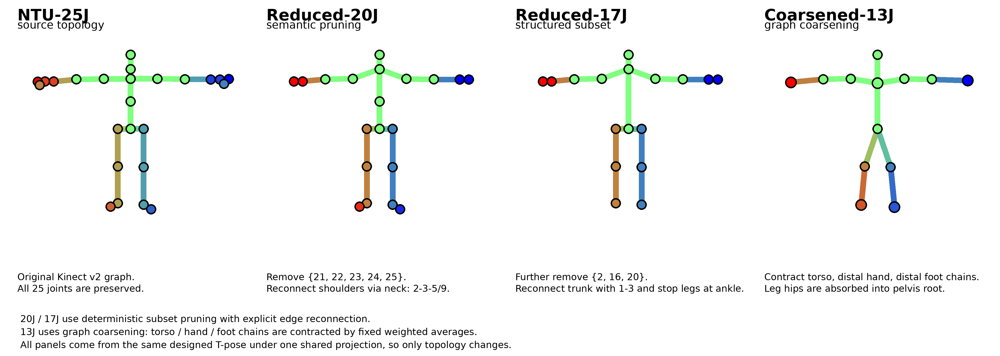

Round 1 materials: [Tables 1–12, Figure 1 (README)](README.md)

**Reviewer qHqH**

- [Figure 2 – NFM Color Change Across Formats](#figure-2)
- [Table 13 – Blend Weight Strategy Ablation](#table-13)
- [Table 14 – Topology Stress Test](#table-14)
- [Figure 3 – Topology Reduction: 25J → 20J / 17J / 13J](#figure-3)
- [Figure 4 – DrAction Rendering Under Reduced Topologies](#figure-4)

**Reviewer 92aF**

- [Figure 5 – Joint Rendering vs. Separate Overlay on Two-Person Actions](#figure-5)
- [Figure 6 – ViT Attention Maps on Multi-Person Rendered Scenes](#figure-6)

---

### Figure 2: NFM Color Change Across Formats — same renderer weights, different skeleton formats

### Table 13: Blend Weight Strategy Ablation, NTU-60 48/12 Xsub

| Weight Strategy | NTU-60 48/12 | NTU-60→NW-UCLA | HumanML3D→NW-UCLA |
| :--- | :---: | :---: | :---: |
| (a) Uniform (w_k,j = 1/J) | 58.41 | 45.67 | 38.82 |
| (b) Distance (proportional to 1/d^2) | 61.81 | 52.53 | 47.16 |
| (c) Learnable | 64.90 | 48.74 | 41.25 |
| **(d) Topology (Ours)** | 64.72 | 60.38 | 56.73 |

---

### Table 14: Topology Stress Test — train on NTU-60 25J, test on reduced topologies

| Train → Test | Topology (Ours) | Uniform (1/J) | Distance (1/d^2) | Learnable |
| :--- | :---: | :---: | :---: | :---: |
| 25J (original) | 64.72 | 58.41 | 61.81 | 64.90 |
| 25J → 20J | 61.84 (−2.88) | 51.57 (−6.84) | 57.48 (−4.33) | 58.76 (−6.14) |
| 25J → 17J | 58.91 (−5.81) | 48.19 (−10.22) | 52.84 (−8.97) | 53.85 (−11.05) |
| 25J → 13J | 52.37 (−12.35) | 40.14 (−18.27) | 45.78 (−16.03) | 45.07 (−19.83) |

---

### Figure 3: Topology Reduction from NTU-25J to 20J / 17J / 13J

---

### Figure 4: DrAction Rendering Under Reduced Topologies

---

### Figure 5: Joint Rendering vs. Separate Overlay on Two-Person Actions

---

### Figure 6: ViT Attention Maps on Multi-Person Rendered Scenes

